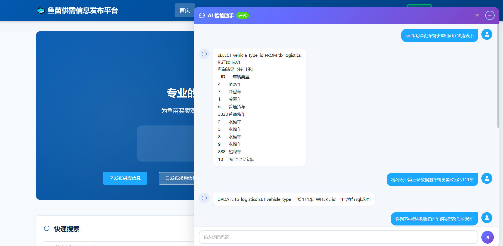

# FishSeedling-Agent — LangChain4j 多节点 Agent 实战项目

> 🔥 **最新 LangChain4j 1.15.0-beta25 + LangGraph4j 1.8.16 实战踩坑全记录**  
> 🎯 关键词：`LangChain4j 教程` `LangChain4j Agent` `LangGraph4j 实战` `LangChain4j Text-to-SQL` `LangChain4j Milvus` `LangChain4j SSE 流式对话` `Java AI Agent`

<div align="center">


</div>

---

## 📖 项目简介

**FishSeedling-Agent** 是一个**面向 Java 开发者的 LangChain4j 企业级 Agent 实战项目**，完整实现了从零搭建多节点 AI 工作流。

如果你正在学习或调研 **LangChain4j**、**LangGraph4j**、**Java AI Agent 开发**，这个项目将为你提供：

- 🏗️ **LangChain4j 1.15.0-beta25** 完整 API 使用示例（AiService / ChatMemory / TokenStream / @Tool）
- 🔀 **LangGraph4j** 图执行引擎实战（条件路由 / Checkpoint 状态持久化 / 流式输出）
- 🧠 **多节点 Agent 工作流**：智能路由 → 知识库 RAG / API 调用 / Text-to-SQL / 互联网搜索 / 闲聊
- 💾 **记忆管理方案对比**：官方自动持久化 vs 手动持久化的优缺点分析
- 🐛 **20+ 个真实踩坑记录**：SSE 传输、LLM 输出不稳定、StreamingGenerator 桥接等

> ⚠️ 本项目使用的 LangChain4j **Beta 模块**（Milvus、experimental-sql、web-search-engine）均为 `1.15.0-beta25`，官方文档极少，全靠源码调试。
🔗 前端项目地址：[FishSeedling-Agent-Vue](https://github.com/hbbc123/FishSeedling-Agent-Vue)
---

## 🏗️ 模块架构

```
myLangChain4j/
├── canal/              # MySQL Binlog 监听（可扩展策略模式）
│   ├── config/         # Canal 连接配置
│   ├── service/        # 表变更处理器（Handbook / HelpContent）
│   ├── utils/          # Canal 消息解析器
│   └── controller/     # Canal 消费者调度器
│
├── graph/              # LangGraph4j Agent 工作流（核心）
│   ├── common/         # 共享组件（AiService 工厂、图状态）
│   │   ├── interfaces/ # AiService 接口定义（8个）
│   │   └── MultipleAiServiceMemory.java  # 统一工厂类
│   ├── controller/     # GraphController（SSE 入口）
│   ├── enums/          # API 方法映射枚举
│   ├── node/           # 图节点（6个）
│   │   ├── ProblemInterpreterAndRouterChecker.java  # 路由判断
│   │   ├── KnowledgeBaseChecker.java                # 知识库检索
│   │   ├── ApiSearchRetrievalChecker.java           # API 检索执行
│   │   ├── SqlRetrievalChecker.java                 # Text-to-SQL
│   │   ├── IQSRetrievalChecker.java                 # 互联网搜索
│   │   └── SmallTalkChecker.java                    # 闲聊对话
│   ├── pojo/           # DTO / 结果对象
│   ├── service/        # GraphService（图引擎）
│   └── utils/          # 流式桥接 / 通用 HTTP 调用 / SQL 表结构提取
│
├── llmTodo/            # LLM Tool 定义（IQS 工具）
│
├── milvus/             # Milvus 向量数据库
│   ├── config/         # 多集合 EmbeddingStore 配置
│   ├── entity/         # ApiDefinition 实体
│   ├── mapper/         # 向量化工具（Handbook / HelpContent）
│   └── service/        # 同步服务（Handbook / HelpContent）
│
├── model/              # LLM 模型配置
│   ├── EmbeddingModelConfig.java
│   ├── OpenAiChatModelConfig.java
│   ├── OpenAiStreamingChatModelConfig.java
│   ├── ScoringModelConfig.java
│   ├── WebSearchEngineConfig.java
│   └── utils/          # 阿里云 IQS / DashScope Reranking 工具
│
├── mongodb/            # MongoDB 对话记忆（备用）
│
└── postgresql/         # PostgreSQL 主存储
    └── mapper/          # Checkpoint 存储 / 对话消息存储
```

---

## 🔄 Agent 工作流

```
用户输入
    │
    ▼
┌──────────────────────────────────────────┐
│         ProblemInterpreter (路由器)        │
│   LLM 分析意图 → 选择下游节点               │
└────┬──────┬──────┬──────┬──────┬─────────┘
     │      │      │      │      │
     ▼      ▼      ▼      ▼      ▼
 Knowledge ApiSearch SqlRetrieval IQS SmallTalk
 (知识库)  (API检索) (SQL执行) (搜索) (闲聊)
     │      │      │      │      │
     └──────┴──────┴──────┴──────┘
                    │
                    ▼
               SSE 流式输出 → 前端
```

### 条件路由表

| 用户输入 | 用户类型 | 目标节点 |
|---|---|---|
| 鱼养殖知识、平台使用方法 | 不限 | Knowledge |
| 行业前景、政策补贴 | 不限 | IQSRetrieval |
| 查询供应/物流数据 | 普通用户 | ApiSearch |
| 增删改查任意操作 | 管理员 | SqlRetrieval |
| 与行业无关的闲聊 | 不限 | SmallTalk |

---

## 🔧 核心功能

### 1. 智能路由 (ProblemInterpreter)
- LLM 分析用户意图 + 对话历史
- 根据用户类型（普通用户/管理员）差异化路由
- 支持 JSON 结构化输出 → 自动反序列化为 `ProblemInterpreterResult`

### 2. 知识库检索 (KnowledgeBase)
- **Milvus 向量数据库**双集合检索（养殖手册 + 帮助内容）
- Ollama `qwen3-embedding:0.6b` 嵌入模型
- 检索为空时自动降级到 IQS 互联网搜索
- DashScope `qwen3-rerank` 重排序

### 3. API 检索执行 (ApiSearch)
- Milvus 向量匹配 API 定义
- LLM 自动提取 HTTP 请求参数
- 通用 HTTP 调用工具（`UniversalApiInvokerUtil`）
- 结果通过 `QueryJsonOrganizeChat` 格式化为 HTML 卡片

### 4. Text-to-SQL (SqlRetrieval)
- LLM 自然语言 → SQL 语句
- `SqlDatabaseContentRetriever` 自动读取表结构
- JDBC 直接执行 SQL（SELECT / INSERT / UPDATE / DELETE）
- 查询结果自动格式化 Markdown 表格
- 支持序号代指（"删除第三条"、"查看第一个"）

### 5. 互联网搜索 (IQSRetrieval)
- 阿里云 IQS WebSearchEngine
- LLM Tool 调用模式（`@Tool` 注解）

### 6. 闲聊对话 (SmallTalk)
- 带记忆的多轮对话
- SystemMessage 定义鱼苗平台人设

### 7. Canal 实时同步
- 策略模式实现可扩展的表监听
- `tb_handbooks` / `tb_help_content` 变更自动同步 Milvus

---

## 🚀 部署方法

### 环境要求

| 组件 | 版本 | 用途 |
|---|---|---|
| JDK | 17+ | 运行环境 |
| MySQL | 8.0 | 业务数据 |
| PostgreSQL | 14+ | 图状态 + 对话记忆 |
| MongoDB | 6.0+ | 会话记忆（备用） |
| Redis | 7.0+ | 限流 / 缓存 |
| Milvus | 2.3+ | 向量数据库 |
| Ollama | Latest | 嵌入模型 |
| Canal | 1.1.8 | MySQL Binlog 同步 |

### 1. 配置 application.yaml

```yaml
server:
  port: 8080
  servlet:
    context-path: /api

spring:
  datasource:
    dynamic:
      primary: mysql
      datasource:
        mysql:
          url: jdbc:mysql://localhost:3306/fish_seedling_platform
          username: root
          password: your_password
        postgresql:
          url: jdbc:postgresql://localhost:5432/fish_seedling_platform
          username: postgres
          password: your_password

llm:
  base-url: https://api.deepseek.com
  api-key: sk-your-deepseek-key
  model-name: deepseek-chat

milvus:
  host: localhost
  port: 19530
  dimension: 1024

canal:
  host: 127.0.0.1
  port: 11111
  destination: example
```

### 2. 初始化数据库
文件在resources下的documents文件夾中
```bash
# 导入业务表结构
mysql -u root -p fish_seedling_platform < aa.sql

# 导入帮助内容数据
mysql -u root -p fish_seedling_platform < help_content.sql
```

### 3. 启动服务

```bash
# 后端
cd backend
mvn clean install
mvn spring-boot:run

# 前端
cd frontend
npm install
npm run dev
```

### 4. 验证

1. 访问 `http://localhost:2999`

2. 点击右下角 AI 助手气泡

3. 输入问题测试各节点功能

   

---

## 🧩 关键技术亮点

### LangChain4j 1.15.0-beta25 新特性

| 模块 | 特性 |
|---|---|
| `langchain4j-milvus` | Milvus EmbeddingStore，支持 Filter 删除 |
| `langchain4j-experimental-sql` | SqlDatabaseContentRetriever，Text-to-SQL |
| `langchain4j-web-search-engine-tavily` | WebSearchContentRetriever |

### 解决的核心难题

- ✅ SSE 流式传输中 `\n` 特殊字符丢失 → JSON 序列化方案
- ✅ LLM 输出格式不稳定 → SystemMessage 精心调优
- ✅ `@MemoryId` 自动持久化缺陷 → 统一手动持久化
- ✅ 图节点异步执行竞态 → 同步等待 API 结果
- ✅ Canal 监听不可扩展 → 策略模式重构

---

## 📚 依赖清单

```xml
<!-- LangChain4j -->
<dependency>
    <groupId>dev.langchain4j</groupId>
    <artifactId>langchain4j</artifactId>
    <version>1.15.0</version>
</dependency>
<dependency>
    <groupId>dev.langchain4j</groupId>
    <artifactId>langchain4j-open-ai</artifactId>
    <version>1.15.0</version>
</dependency>

<!-- LangChain4j Beta Modules (1.15.0-beta25) -->
<dependency>
    <groupId>dev.langchain4j</groupId>
    <artifactId>langchain4j-milvus</artifactId>
    <version>1.15.0-beta25</version>
</dependency>
<dependency>
    <groupId>dev.langchain4j</groupId>
    <artifactId>langchain4j-experimental-sql</artifactId>
    <version>1.15.0-beta25</version>
</dependency>

<!-- LangGraph4j -->
<dependency>
    <groupId>org.bsc.langgraph4j</groupId>
    <artifactId>langgraph4j-core</artifactId>
    <version>1.8.16</version>
</dependency>
<dependency>
    <groupId>org.bsc.langgraph4j</groupId>
    <artifactId>langgraph4j-langchain4j</artifactId>
    <version>1.8.16</version>
</dependency>
```

---

## 📄 相关文档

- [LangChain4j + LangGraph4j 开发总结](./LangChain4j-开发总结.md) — API 使用心得、图流程、记忆管理、难点分析

---

## 🔍 搜索引擎友好标签

`LangChain4j 教程` `LangChain4j Agent` `LangChain4j 实战` `LangChain4j 示例`  
`LangGraph4j 教程` `LangGraph4j 实战` `Java AI Agent` `Java LLM`  
`LangChain4j Text to SQL` `LangChain4j Milvus` `LangChain4j RAG`  
`LangChain4j SSE` `LangChain4j ChatMemory` `Spring Boot AI`  
`DeepSeek LangChain4j` `Ollama LangChain4j` `LangChain4j 1.15`

---

<div align="center">
  <sub>Built with ❤️ by <a href="https://github.com/hec9524">贺畅</a> | LangChain4j 1.15.0-beta25 | LangGraph4j 1.8.16</sub>
</div>
